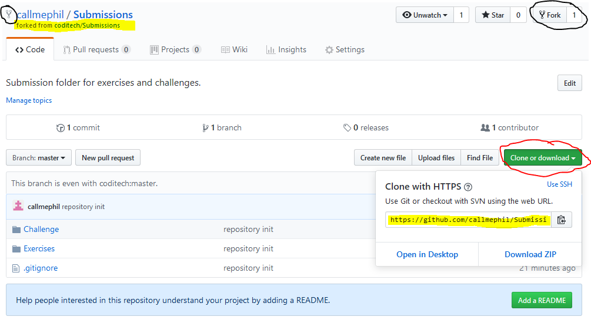

# Online Git & CodiTech

As you have learned previously with Git basic 01, you can create a local directory to keep track of your changes.
But what if you want to work in team or remotely ?

Several solutions exists. The most common and free to use are Github and Gitlab.

You can research more about Github vs Gitlab. Here are some links.

* [Gitlab (Github Vs Gitlab)](https://about.gitlab.com/devops-tools/github-vs-gitlab.html)
* [Hackernoon](https://hackernoon.com/github-vs-gitlab-which-is-better-for-open-source-projects-31c45d464be0)
* [Google](https://www.google.com)

Keep in mind that online platforms such as Github and GitLab still use the Git system. You will **not** work directly on the website. You will **keep** working with command lines that you have seen in  [Git basic 01](./git-basics-01.md).
But instead of **push** your change locally, you will **push** them online so you or someone else can view/retrieve them easily.

> During your **Codi training** you will use Github. Why ? Because Github provides us with certain solutions such as Gitbook and bigger exposure on the internet for potential employers.

We call online folder/files storage "repository or repo". They hold your project. A repository can have many branches. A repository can be private or public and can have one or many collaborators. (this part here is a little confusing because we still havent been introduced to the concenpt or branches, private, public, collaborators, fork)

## CodiTech
At Codi we have our own organization hosted on github : [CodiTech](www.github.com/coditech)

It contains multiple repositories. These are the main ones :
* Documentation 
> This is for Gitbook, All of the documentation files are hosted there. You will not need to **fork** this.
* Submission Folder
> This will be the main repository for your exercises and challenges.
* Team Projects (e.g. Prefab-Houses)
> Certain team projects will require you to **fork** additional repositories. Team projects are some of them.

What is fork ? [Secret](https://help.github.com/en/articles/fork-a-repo)

## Setup 
#### Github
1. Lets create a [Github Account](https://github.com/join?source=header-home)
> Fill the form and don't forget to add a picture so we can recognize each others =)
2. Visit Coditech [CodiTech](https://github.com/coditech)
> Great ! You can now navigate threw the different repositories of coditech. **don't close the tab**
3. (Optional) Join the Codi tech Organization !
> **If the join button does not appear then please send us your github nickname on discord**

Good you're all set !
#### Brief 
The difference between online and local git is that you are **not** going to use **.git init**. Instead clone will bind your folder to the online repository.

##### Important Terms
1. CLONE : This is how you get the files on your computer by downloading the online repository to your local machine. 
2. FORK : With any online version control manager you have the ability to 'copy' a repository to your own personal space. So you can work on it on your own or with your team, without altering the original repository files.
3. PULL : Sometime your local folder is not up to date. Git pull will grab all the recent changes and update it for you. You can't pull if there is active changes that has not been staged.
4. MERGE : Merge & Merge Request. They are the root of team sharing. When you or your collaborator will do a change on his repository or branch and you may request to update the changes. 
> Merge can have conflicts. For instance if the same file is edited twice by two different person git will ask you to verify and edit the changes manually.

## Submission Repository
During prairie you will have to do some exercises to get keys. These exercises will have to be pushed in a submission folder.
The [Submission Repository](https://github.com/coditech/Submissions) is present in Coditech Github. 

1. It's time to fork it! We will use the graphical interface for that.
Get to the Submission repository and lets fork it to our own repository space.

 1. Click on the Fork button and let github do the job for you.
> Done ? You should now see it in your repository's list. Github redirects you automatically to it. If you have trouble finding it, you can use this url https://github.com/YOURUSERNAME/Submissions *don't forget to edit **YOUR USER NAME**.
2. Great ! We will clone into our computer now. There are different clone protocosl (HTTPS & SSH). For now we will use the simple https protocol.

 1. Click on the green button "Clone or download" and copy the link provided.
 2. Open your terminal and move to Desktop. This is where the repository will be downloaded
 3. Write the following command to clone
```sh
    $(username): git clone **paste your link (ctrl + shift + v)**
```
> By default clone command will create a folder named like your online repository, in our case it will be **Submission**. You can override this by adding an additional argument in the command line as follows.
```sh
    $(username): git clone **paste your link (ctrl + shift + v)** YOURFOLDERNAME
```
  4. Done ? We are set ! Just one more thing...

> You can download manually a repository without cloning but this will not include the .git files

*** !! Submission folder might recieve updates !! ***
In case you need to update your repository read the instruction located [here](https://gist.github.com/CristinaSolana/1885435#gistcomment-2857738) 

## Git Software Manager
Git system is huge and it can be tiresome when you have to deal with problems. Fortunatly there is many alternative solution to command lines and we call them Git Managers.

Most used at the momment..
1. [GitKraken](https://www.gitkraken.com/) **Cross-Platform**
2. [PocketGit](http://pocketgit.com/) **Android**
3. [Git2Go](https://git2go.com/) **IOS**

Of course, there's plenty of other softwares. Here is the list : [git-scm](https://git-scm.com/downloads/guis/)

Fortunately for us we won't have to use any of those. Instead we have Visual Studio Code. VS Code has an integrated git manager. I recommend watching this video to know more about it. [VSCode Tutorials #4 - Git Integration](https://www.youtube.com/watch?v=6n1G45kpU2o)

## Next..
You are done with Git-basics? Move on to the Git-basic-trial and show us what you got ! 
