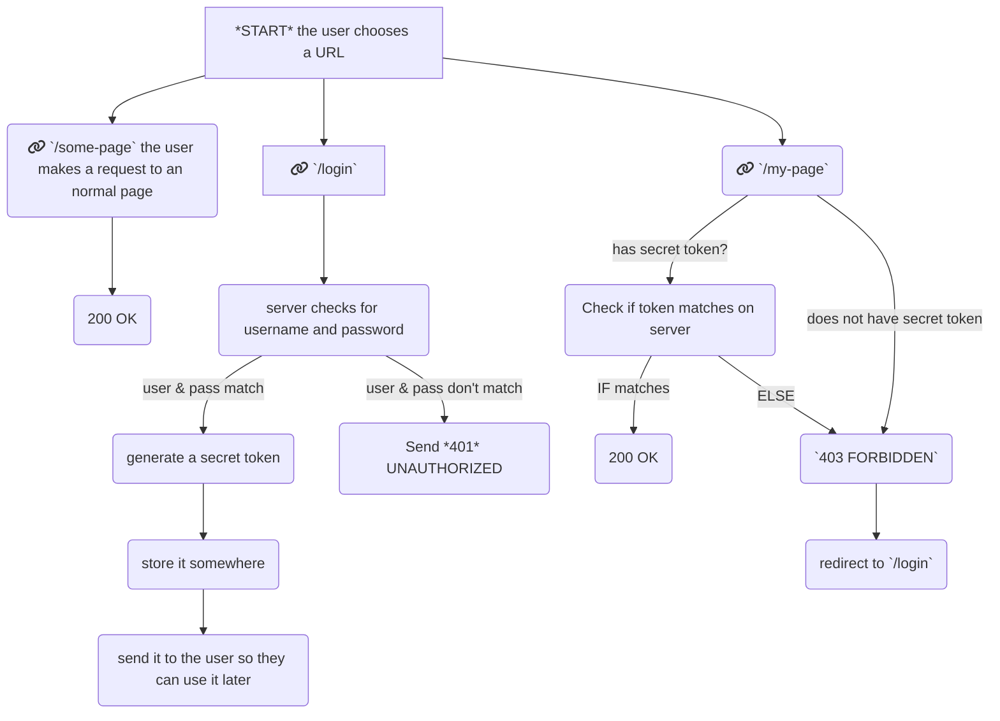

# Simple Authentication : PART I (Node)

Authentication is *hard*. We will try to get down to basics here, hang on to your belts.

Implementing your own authentication system is rarely a good idea, but we still will describe the basic process, for the purposes of illustration:

1. Front End:
  1. create a form with user and password
  2. send the data to an express route
2. Back End
  1. in Express, check if the user and password match
  2. if yes, send back a unique id we can use to identify the user
  3. if no, send back an error
3. Front-end
  1. when an answer is received, if positive, store the id in a cookie (localStorage, ...)
  2. from now on, send the id with each request so the server can recognize the user

There are many, many, many different moving parts to keep track of, including which cryptographic algorithm to use, how to handle password resets, and so on. It is never a good idea to try to do that, unless you are a seasoned professional.

In general, you'll be using [Passport](http://www.passportjs.org/). Passport allows to implement relatively easily different strategies, including logging in through Google, Twitter, Github, Facebook, and [502 other ones](http://www.passportjs.org/packages/). However, the documentation of Passport is so notoriously bad that unrelated users maintain an [external documentation](https://github.com/jwalton/passport-api-docs) just to make things easier for everyone.

Before you will implement proper Authentication in your Node app, read [Your Node Authentication Tutorial Is Wrong](https://hackernoon.com/your-node-js-authentication-tutorial-is-wrong-f1a3bf831a46) first, and take inspiration from [this implementation](https://gitlab.com/sharkattack/express-authentication). If possible at all, use a third party like [Firebase](https://firebase.google.com/) or [Auth0](https://auth0.com/).

Here's the most important advice: It's impossible to steal your gold if you have no gold; similarly, always thrive to store only the least possible amount of information on your server. Delegate the responsibility of logins to a 3rd party, whenever possible.  
Actually, don't have logins at all when your project allows it.

Here's the logic for a request to a page that should be behind a login:

```
*START*: the user chooses a url  

1. `/login` the user enters a user name and a password in a login page  
  1. *IF* the user is already logged in  
    1. redirect to `/`  
  2. *ELSE*, the server checks that this user name and password matches with a record  
    1. *IF* it matches  
      1. generate a secret token  
      2. -->(store it somewhere so it can easily be looked up)-->b(send it to the user)
      4. a(go back to *START*)
    2. *ELSE*  
      1. send `401 UNAUTHORIZED`, possibly with an error message  
2. `/some-page` the user makes a request to an normal page  
  1. the server sends the authorized page  
  2. go back to *START*  
3. `/my-page`, the user makes a request to a protected page  
  1. *IF* the user has a secret token, she sends it with the request  
    1. *IF* the token exists also on the server, the user is guessed from the token  
      1. send the page, status `200 OK`, go back to *START*  
    2. *ELSE*  
      1. send `403 FORBIDDEN`  
      2. redirect to `/login`  
  2. *ELSE*, the request is made without the secret token  
      1. the server refuses the request, `401 FORBIDDEN`  
      2. redirect to `/login` 
```

Here is the same flow in graph form:



Let's implement that.

We're going to need:

1. a place to store tokens. This will be a simple javascript object (later on, we can store those in the database or wherever convenient)
2. a way to authenticate users. We'll just have a static list of usernames & passes (later, we can switch to a database for this too)
3. a way to login
4. a way to ensure a user is logged in

You may not know, but routes in Express are stackable. That is, if you do

```js
const first = (req, res, next ) => {
  next()
}
const second = (req, res, next ) => {
  if(req.query.pass === 'ok'){
    next()
  }else{
    res.send('second handler')
  }
}
const third = (req, res, next ) => {
  res.send('third handler')
}
const fourth = ( err, req, res, next ) => {
  res.send('error')
}
app.get('/route',first,second,third,fourth)
```

In the scenario above, the request to `/route`will go through `first`, and `second`, but never `third`. A request to `/route?pass=ok` will pass by all three first handlers, but not the fourth.

However, calling `next` with an error 

```js
next(new Error('oh no'))
```

...will skip all handlers until the last.

This allows us to do logged in checks relatively easily, in this way:

```js
const isLoggedIn = (req, res, next) => {
  if(something_that_checks_for_user() === true){
    next()
  }
  else{
    next(new Error('error, you are not allowed'))
  }
}

app.get('/some/protected/route', isLoggedIn, (req, res, next) => {
  //user is logged in
})

app.use((err, req, res, next) => {
  res.send('sorry, you need to be authenticated')
})
```

Armed with this information, let's do this. Create a new file, `auth.js`

```js
// back/src/auth.js

/**
 * this is our users database
 **/
const users = [
  { nick:'anna', name:'nina.williams@tek.ken', password:'hapkido' },
  { nick:'shao', name:'johnny.cage@mk.com.bat', password:'hunter2' },
  { nick:'ryu', name:'ken.masters@sf.er', password:'shoryuken' },
  { nick:'a', name:'a', password:'b' }, // this one is for easy testing
]

/**
 * this is our logged in users.
 * In this example, `ken` is logged in (we suppose Ken, on the other side, 
 * holds the same token in their browser)
 * Of course, this token should be something unknowable, not a simple word like "test"
 **/
const tokens = {
  'test':2
}

export const authenticateUser = (req, res, next) => {
  if(!req.query.username || !req.query.password){
    return res.status(401).json({
      success:false,
      message:'username and password are both necessary'
    })
  }
  const { username, password } = req.query
  // let's find the user who has both the provided username, and the provided password
  const userIndex = users.findIndex( u => u.password === password && u.name === username)
  if(userIndex < 0 ){
    return res.status(401).json({
      success: false,
      message:'wrong username or password'
    })
  }
  // here, the user has been found, we can create a token and assign it:
  const user = users[userIndex]
  const nick = user.nick
  const token = Math.random()+"" // <-- this is *absolutely* not random enough for production
  tokens[token] = userIndex
  res.json({
    success:true,
    result: {
      nick,
      token
    }
  })
}

export const logout = (req, res, next) => {
  const token = req.query.token
  if(!token){
    // if there's no token, there's nothing to do
    // we could return an error, but we don't want to disclose
    // information about the internals. We'll return success anyway
    return res.json({ success: true })
  }
  if(typeof tokens[token] === 'undefined'){
    // if the token is not found, there's nothing to do either
    return res.json({ success: true })
  }
  // we remove the token from the object
  delete tokens[token]
  return res.json({ success:true })
}

export const isLoggedIn = (req, res, next) => {
  const token = req.query.token
  if(!token || (typeof tokens[token] === 'undefined')){
    return res.status(403).json({ success: false, message: 'forbidden' })
  }
  const userIndex = tokens[token]
  const user = users[userIndex]
  req.is_logged_in = true
  req.user = user // we set this on `req` so subsequent handlers can check this
  next()
}
```

Import the methods in `index.js`

```js
// back/src/index.js
...
import { authenticateUser, logout, isLoggedIn } from './auth'
...
  app.get('/login', authenticateUser)
  
  app.get('/logout', logout)
  
  app.get('/mypage', isLoggedIn, ( req, res ) => {
    const username = req.user.name
    res.send({success:true, result: 'ok, user '+username+' has access to this page'})
  })

```

Remember to place those methods *above* the error handler.

Now, let's try this! Run the backend, and, in your browser, open:

- http://localhost:8080/mypage -> you should get an error
- http://localhost:8080/mypage?token=test -> you should be logged in as Ken Masters
- http://localhost:8080/login?username=a -> you should get an error
- http://localhost:8080/login?username=a&password=b -> you should be logged in. Note the token, and
- http://localhost:8080/mypage?token=<TOKEN> -> put the token you had before. You should access the page 
- http://localhost:8080/logout?token=<TOKEN> -> put the token you had before. You should log out
- http://localhost:8080/mypage?token=<TOKEN> -> put the token you had before. You should not have access the page anymore 

Tada, you have a login system.

Once you verified everything works to your liking, move to [calling the authentication methods React-side](./02-react.md)